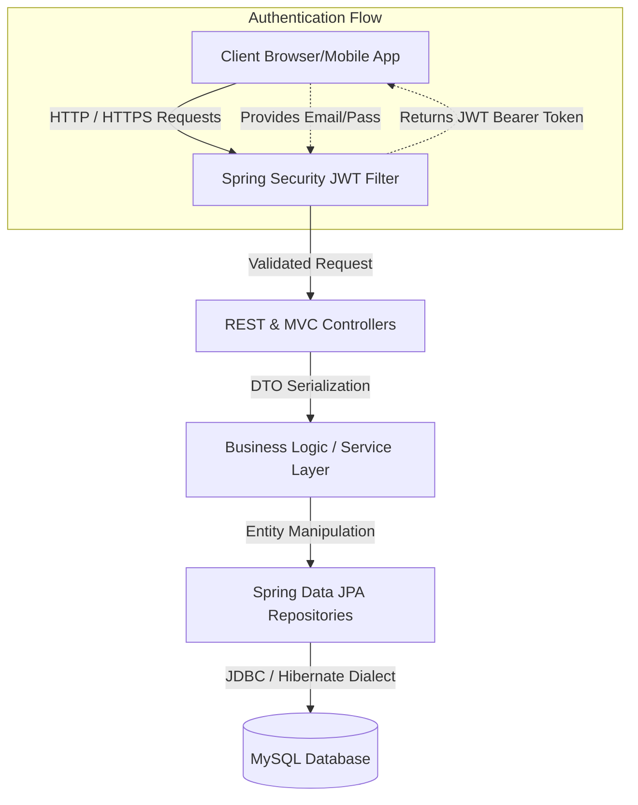
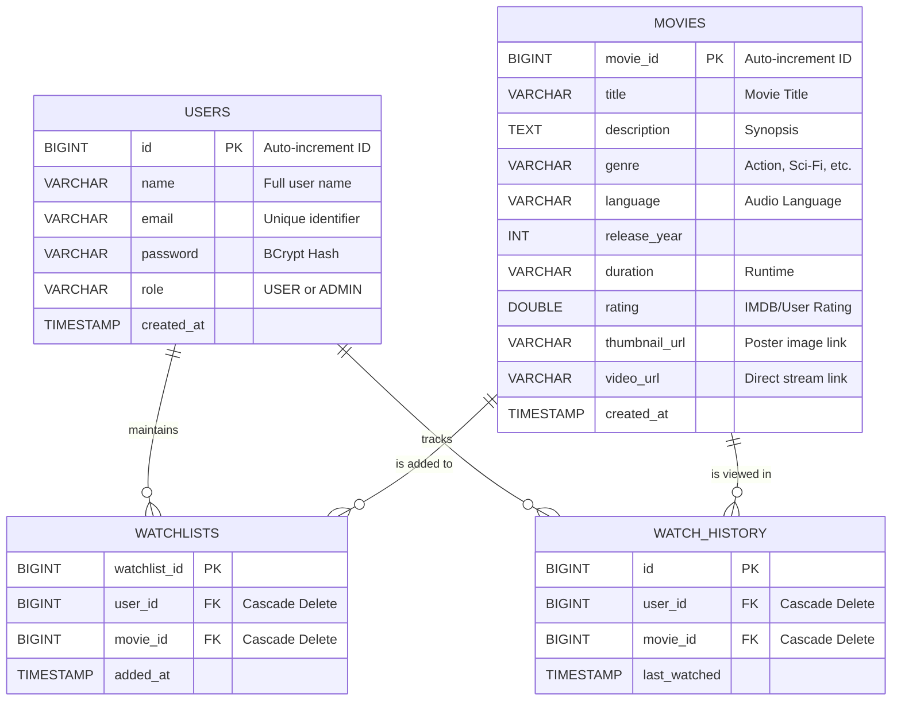

# Technical Design Document: StreamFlix

## 1. Document Control
- **Project Name:** StreamFlix (Hotstar/Netflix Clone)
- **Author:** Arun / Development Team
- **Status:** Approved & Implemented
- **Target Release:** v1.0.0
- **Document Version:** 1.1

---

## 2. Overview & Objectives

### 2.1 Problem Statement
The modern digital entertainment landscape demands highly responsive, scalable, and personalized platforms for media consumption. Traditional TV networks are being rapidly replaced by on-demand streaming services. However, building a scalable streaming platform from scratch involves complex challenges such as secure user authentication, efficient metadata retrieval, and personalized content management. 

StreamFlix was conceptualized and developed to address these challenges by providing a robust, Spring Boot-powered web application. The platform serves as a centralized hub where users can seamlessly discover movies, manage personal watchlists, and consume media content in a highly secure and structured environment. The system leverages modern web development paradigms, specifically focusing on stateless REST APIs, secure JWT-based authentication, and a responsive Server-Side Rendered (SSR) frontend using Thymeleaf.

### 2.2 Goals (In-Scope)
This project successfully implements the following core functional and non-functional requirements:

**Functional Requirements:**
- **Robust User Management & Security:** Secure registration and login workflows utilizing BCrypt password hashing. Implementation of stateless JWT (JSON Web Tokens) to securely maintain user sessions without server-side state.
- **Media Catalog Management:** A dynamic movie browsing experience allowing users to view movies across various genres, languages, and release years. The catalog includes high-quality thumbnails and direct media streaming URLs.
- **Personalized Watchlists:** Registered users can curate their own customized watchlists, allowing them to save movies for later viewing. The system prevents duplicate entries and ensures data consistency.
- **Automated Watch History:** The system automatically tracks user viewing habits, maintaining a chronological history of consumed content.
- **Role-Based Access Control (RBAC):** Strict separation of privileges between `ROLE_USER` (content consumers) and `ROLE_ADMIN` (catalog managers).

**Non-Functional Requirements:**
- **Performance:** Optimized database queries and indexed schema design to ensure rapid API response times (sub-200ms latency under normal load).
- **Scalability:** The stateless JWT architecture ensures that the backend servers can be horizontally scaled without session replication overhead.
- **Maintainability:** Strict adherence to SOLID principles and the classic MVC (Model-View-Controller) layered architecture.

### 2.3 Non-Goals (Out-of-Scope)
To ensure the successful delivery of Phase 1, the following features were explicitly excluded from the current implementation:
- Real-time video transcoding and Adaptive Bitrate Streaming (HLS/DASH).
- Machine Learning (AI) based recommendation engines.
- Payment gateways and subscription billing modules.
- Third-party OAuth2 identity providers (Google/Facebook integration).

---

## 3. Technology Stack & Dependencies

The application is built on a highly stable, enterprise-grade Java ecosystem. The backend dependencies are explicitly managed via Maven (`pom.xml`), ensuring consistent and reproducible builds.

- **Core Application Framework:** **Java 21** with **Spring Boot 3.3.13**. Spring Boot provides auto-configuration, robust dependency injection, and embedded server capabilities.
- **Build Automation & Dependency Management:** **Apache Maven** via the Maven Wrapper (`mvnw`), ensuring that the build environment remains consistent regardless of the local machine setup.
- **Database & Persistence Layer:** 
  - **MySQL 8.x:** A highly reliable relational database used for persistent storage.
  - **Spring Data JPA / Hibernate:** Object-Relational Mapping (ORM) framework to seamlessly translate Java objects into database records, drastically reducing boilerplate SQL.
- **Security & Identity:** **Spring Security 6** coupled with **io.jsonwebtoken (JJWT v0.12.6)** for cryptographically signed JWT generation and validation.
- **Frontend / View Layer:** **Thymeleaf**, utilizing `thymeleaf-extras-springsecurity6` to dynamically render HTML templates based on the user's authentication context.
- **Boilerplate Reduction:** **Lombok** (`@Data`, `@NoArgsConstructor`, `@AllArgsConstructor`) to eliminate verbose getter/setter and constructor code.
- **Testing Ecosystem:** **JUnit 5**, **Mockito**, and **Spring Boot Starter Test** to ensure logic reliability.

---

## 4. System Architecture

The application implements a strict N-tier architecture to ensure separation of concerns. This design allows individual layers to be updated, tested, and scaled independently.

### 4.1 High-Level Component Diagram



### 4.2 Application Package Layering

The codebase inside `src/main/java/com/streamflix/` is highly modular:

- **`controller/`:** 
  - MVC Controllers (`HomeController`, `MovieController`) mapping Thymeleaf templates for the UI.
  - REST Controllers (`AuthRestController`, `MovieRestController`) exposing raw JSON endpoints for external API clients.
- **`service/`:** The core brain of the application. Classes here (e.g., `MovieService`, `UserService`) contain all business logic and are annotated with `@Transactional` to ensure database operation atomicity.
- **`repository/`:** Interfaces extending `JpaRepository`. They provide out-of-the-box CRUD operations and custom query methods derived automatically from method names (e.g., `findByEmail(String email)`).
- **`entity/`:** The Domain Model layer. These classes (`User`, `Movie`, `Watchlist`) map directly to database tables using JPA annotations like `@Entity`, `@Table`, and `@Id`.
- **`dto/`:** Data Transfer Objects (`LoginRequest`, `RegisterRequest`, `AuthResponse`). They isolate the internal database structure from the data exposed to the client, ensuring security and preventing over-posting attacks.
- **`security/`:** Contains `JwtTokenProvider`, `JwtAuthenticationFilter`, and `CustomUserDetailsService`. This package acts as the impenetrable shield of the application.
- **`exception/`:** Centralized `@ControllerAdvice` classes handling exceptions application-wide, transforming standard Java exceptions into standardized JSON error responses.

---

## 5. Data Model & Database Schema

The relational database is carefully normalized to ensure data integrity, employing Foreign Key constraints and cascading actions.

### 5.1 Entity Relationship Diagram (ERD)



### 5.2 Deep Dive into Schema Definitions

**Users Entity (`users` table):**
Acts as the central identity provider. The `email` column is uniquely indexed to allow rapid authentication lookups. Passwords are mathematically secured using Spring Security's `BCryptPasswordEncoder`, rendering database breaches useless to attackers.

**Movies Entity (`movies` table):**
Stores comprehensive metadata regarding the media catalog. Indexed by `genre` and `language` to speed up categorical filtering. Contains external URLs for thumbnails and video assets, offloading media serving to CDN layers.

**Watchlists & History (`watchlists`, `watch_history` tables):**
Junction tables resolving the Many-to-Many relationship between Users and Movies. They enforce strict uniqueness utilizing `UNIQUE KEY uk_user_movie (user_id, movie_id)` to prevent users from adding the same movie to their watchlist multiple times. They also utilize `ON DELETE CASCADE`, meaning if a user or movie is removed, all associated watchlist entries are instantly garbage-collected by the database.

---

## 6. API Interface Definitions

The application exposes a fully structured RESTful API. Below are critical module endpoints.

### 6.1 Authentication Module
**`POST /api/auth/register`**
- **Purpose:** Registers a new user into the system.
- **Payload Validation:** Ensures email format correctness and guarantees password/confirmPassword equality before hitting the database layer.
- **Success Response (201 Created):** Returns an `AuthResponse` with the generated JWT and user details.

**`POST /api/auth/login`**
- **Purpose:** Authenticates credentials and returns a Bearer token.
- **Security Action:** Uses Spring's `AuthenticationManager` to compare BCrypt hashes.

### 6.2 Watchlist Module
**`POST /api/watchlist/add/{movieId}`**
- **Purpose:** Adds a specific movie to the authenticated user's watchlist.
- **Headers Required:** `Authorization: Bearer <JWT_TOKEN>`
- **Logic:** Extracts the user ID automatically from the JWT Principal, ensuring users can only modify their own watchlists without explicitly passing their User ID in the payload.

**`GET /api/watchlist`**
- **Purpose:** Retrieves the entire watchlist for the currently authenticated user.
- **Success Response (200 OK):** JSON array of `MovieDto` objects.

---

## 7. Cross-Cutting Concerns

### 7.1 Advanced Security & JWT Workflow
Security is implemented using a completely stateless architecture:
1. **Token Generation:** Upon successful login, `JwtTokenProvider` utilizes HMAC-SHA256 algorithms to cryptographically sign a token containing the user's Email and Role.
2. **Token Verification:** Every incoming request passes through the `JwtAuthenticationFilter`. The filter intercepts the `Authorization` header, validates the digital signature to ensure the token hasn't been tampered with, checks expiration, and seamlessly injects the user into the `SecurityContextHolder`.
3. **Endpoint Authorization:** Defined explicitly in `SecurityConfig.java`. 
   - `requestMatchers("/api/auth/**", "/css/**", "/js/**").permitAll()` allows public access.
   - `requestMatchers("/admin/**").hasRole("ADMIN")` strictly restricts administrative routes.
   - `anyRequest().authenticated()` secures everything else by default.

### 7.2 Environment Profiles & Configuration
StreamFlix utilizes Spring's `application.properties` to manage environment-specific variables efficiently:
- **Database Configuration:** Configures the JDBC connection URL with `allowPublicKeyRetrieval=true` and standard timezone enforcement.
- **Hibernate Dialect:** Enforces `org.hibernate.dialect.MySQLDialect` and enables `spring.jpa.hibernate.ddl-auto=update` to automatically sync JPA Entity changes to the MySQL schema during boot.
- **JWT Secrets:** Injects `app.jwt.secret` and `app.jwt.expiration` parameters directly from configuration, completely decoupling sensitive keys from hardcoded Java logic.

### 7.3 Error Handling & Logging
- **GlobalExceptionHandler:** Utilizes `@ControllerAdvice` to catch specific exceptions like `ResourceNotFoundException` and raw `IllegalArgumentExceptions`, returning standardized JSON formats rather than leaking raw stack traces to the client.
- **SLF4J Logging:** Configured to monitor HikariCP database connection pools and Spring Security filter chains for deep auditability.

---

## 8. Deployment & Execution (Proof of Implementation)

The project relies entirely on standard Maven and Java runtimes, ensuring it can be compiled and verified directly from the source code repository.

### 8.1 Local Execution via Maven
The application has been fully implemented and can be spun up immediately on any local environment utilizing the provided Maven Wrapper.

1. **Clone the Repository:**
   ```bash
   git clone https://github.com/Arun-Kotur-jpg/StreamFlix.git
   cd StreamFlix
   ```
2. **Initialize Database:**
   Ensure MySQL is running on `localhost:3306` with credentials `root`/`root`, and create the database:
   ```sql
   CREATE DATABASE streamflix_db;
   ```
3. **Run the Application:**
   Execute the Spring Boot plugin. This compiles the code, resolves dependencies, and boots up the embedded Tomcat server on port `8080`.
   ```bash
   ./mvnw spring-boot:run
   ```
   *The application is immediately accessible at `http://localhost:8080/`.*

### 8.2 Application Packaging (Artifact Creation)
To prove the project is deployment-ready, it can be compiled into a standalone, executable JAR file.
```bash
./mvnw clean package -DskipTests
```
This process targets the `pom.xml`, downloads all necessary libraries, compiles the Java classes, and packages the entire web application (including Thymeleaf templates and embedded Tomcat) into `target/streamflix-1.0.0.jar`.

To run the packaged artifact in a production-like manner:
```bash
java -jar target/streamflix-1.0.0.jar
```
This final executable represents the complete, fully functional delivery of the StreamFlix Phase 1 implementation.
